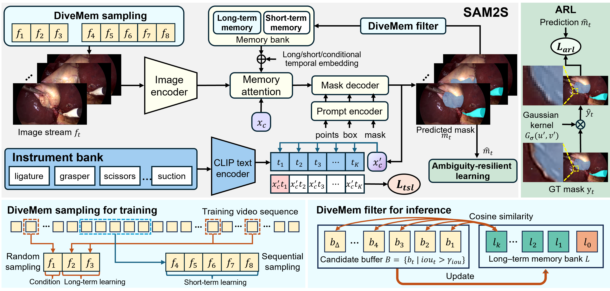

# SAM2S: Segment Anything in Surgical Videos via Semantic Long-term Tracking
[](https://jinlab-imvr.github.io/SAM2S)
[](https://arxiv.org/abs/2511.16618)
[](https://arxiv.org/pdf/2511.16618.pdf)


<div align="center">

</div>

Official implementation of SAM2S, a foundation model that enhances SAM2 for surgical interactive Video Object Segmentation (iVOS) through semantic long-term tracking and domain-specific adaptations. The source code is coming soon.

>Haofeng Liu, Ziyue Wang, Sudhanshu Mishra, Mingqi Gao, Guanyi Qin, Chang Han Low, Alex Y. W. Kong, Yueming Jin


## Overview


Surgical video segmentation is crucial for computer-assisted surgery, enabling precise localization and tracking of instruments and tissues. While SAM2 provides prompt-based flexibility, it faces significant challenges in surgical scenarios due to domain gaps and limited long-term tracking capabilities.

SAM2S addresses these limitations through:

1. **SA-SV Benchmark Construction**: Large-scale surgical iVOS dataset spanning diverse procedures (cholecystectomy, colonoscopy, nephrectomy, prostatectomy, etc.) with instance-level spatio-temporal annotations
2. **Enhanced Long-term Tracking**: DiveMem employs hybrid temporal sampling during training and diversity-based frame selection during inference
3. **Semantic Understanding**: TSL leverages semantic categories of surgical instruments while preserving class-agnostic generalization
4. **Multi-source Robustness**: ARL handles annotation ambiguities through uniform label softening


<p align="center"><i>Overall of SAM2S</i></p>


<p align="center"><i>SAM2S Framework Architecture</i></p>

## Citation
```bibtex
@article{liu2025sam2s,
  title={SAM2S: Segment Anything in Surgical Videos via Semantic Long-term Tracking},
  author={Liu, Haofeng and Wang, Ziyue and Mishra, Sudhanshu and Gao, Mingqi and Qin, Guanyi and Low, Chang Han and Kong, Alex Y. W. and Jin, Yueming},
  journal={arXiv preprint arXiv:2511.16618},
  year={2025}
}
```